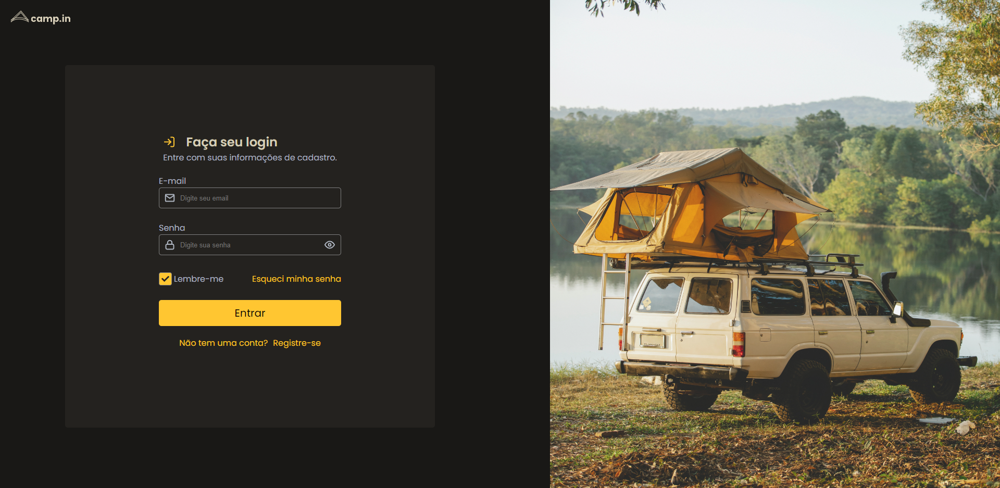

<<<<<<< HEAD
# Formulário Camp-in

> Desafios Rocketseat

Projeto desenvolvido para aprimorar conhecimentos.

## Tecnologias 

- HTML
- CSS 
- Git e Github

## Contato 

yurifurquimdev@gmail.com
=======
### Project 
# Camp-in

O projeto camp-in consiste é um formulário para inscrições de um acampamento, onde poderá você levar seu motorhome, barraca, tenda e etc para se acomodar! 
>>>>>>> 498bdb2f74207edc4642a79c9b4a3695779c308d
